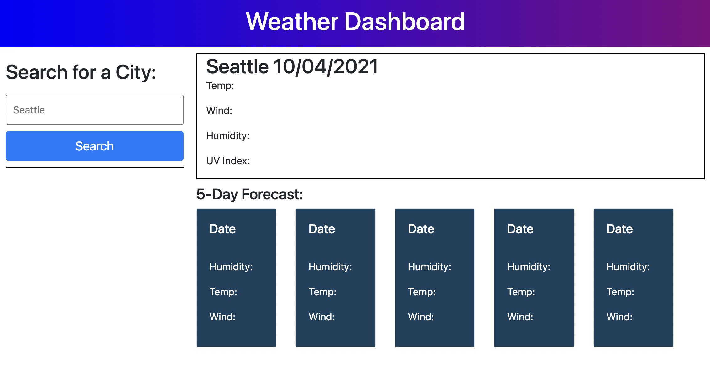
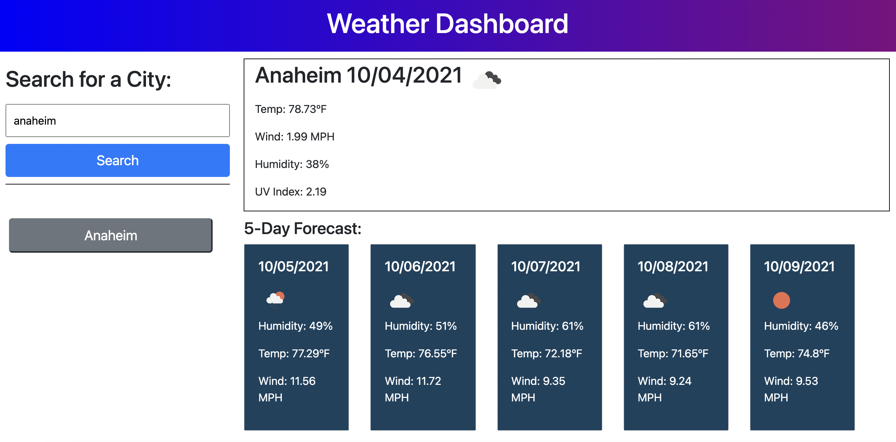

# weather-dashboard
This website allows you to search up any city of your choice and it will display the current weather at the top. Below the current weather, the forecast for the next 5 days will also appear so that, as a traveler, you can plan ahead. Once you've searched a place, it will also show up in your past searches as a button that you can click and it will display that city's information. Also since the information is saved to local storage, even after a refresh, the button will remain from the past searches.

## Deployment
The website can be found if you click [here](https://kelliekumasaka.github.io/weather-dashboard/). 

## Content
When you open the web page, this is what it looks like.

Upon researching a city, you see its current weather and information. 

## Conclusion
The fully functioning website will give you the information you need, as a traveler. 